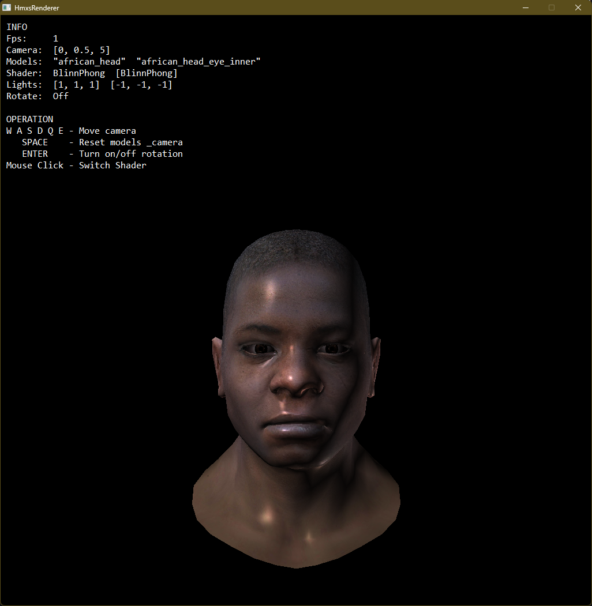

# HmxsRenderer

> `HmxsRenderer` is a simple software 3D renderer without third-party libraries. It is written in pure C++ and uses `Windows GDI` for rendering.

This project is an iteration of my previous project [Graphics - TinyRenderer](https://github.com/hmxsqaq/Graphics-TinyRenderer) and is inspired by the project [tinyrenderer](https://github.com/ssloy/tinyrenderer/wiki) by Dmitry V. Sokolov.

Compared to the previous project, this project has more features such as: `runtime display` and `a simple user interface`. And the code is more organized and more compliant with the modern C++ standard.

I wrote this renderer to learn more about 3D graphics and to have fun. It is not intended to be a production-ready renderer. Although the renderer is simple and slow, it provides good practice for me in learning the fundamentals of 3D graphics.

## Installation

### Prerequisites
- Windows OS (Win32 API required)
- CMake 3.28 or higher
- C++20 compatible compiler (MSVC, MinGW, etc.)

### Build Instructions

1. Clone the repository:
```bash
git clone https://github.com/hmxsqaq/Graphics-HmxsRenderer.git
cd Graphics-HmxsRenderer
```

2. Build with CMake:
```bash
mkdir build
cd build
cmake ..
cmake --build .
```

3. Run the executable:
```bash
.\bin\Graphics_HmxsRenderer.exe
```

The assets directory will be automatically copied to the build output directory.

## Features

### Core Rendering Capabilities

- [x] **Pure C++ Implementation** - No third-party graphics libraries, built from scratch
- [x] **Custom Math Library** - Self-implemented Vector and Matrix classes with template support
- [x] **Model Loading** - `.obj` file format support with vertex, normal, and texture coordinates
- [x] **Texture System** - `.tga` image reader/writer with RLE compression support
- [x] **Line Rasterization** - Bresenham-based line drawing algorithm
- [x] **Triangle Rasterization** - Scanline-based triangle filling with bounding box optimization
- [x] **Barycentric Coordinates** - Perspective-correct interpolation for attributes
- [x] **Depth Buffer (Z-Buffer)** - Hidden surface removal with depth testing
- [x] **Texture Mapping** - UV-based diffuse and specular texture mapping
- [x] **Normal Mapping** - Support for both object-space and tangent-space normal maps
- [x] **Phong Shading** - Multiple lighting models (Phong, Blinn-Phong)
- [x] **Customizable Shader System** - Programmable vertex and fragment shader interface
- [x] **Dual Render Path** - Both forward and deferred rendering pipelines
- [x] **G-Buffer Support** - Geometry buffer for deferred shading
- [x] **Multi-Light Support** - Multiple directional lights with intensity control
- [x] **Runtime Display** - Real-time rendering window using Win32 GDI
- [x] **Interactive Controls** - Keyboard/mouse input for camera movement and shader switching
- [x] **OpenMP Acceleration** - Parallel rasterization for improved performance

### Platform & Architecture
- [x] **Win32 Integration** - Native Windows API for window management and rendering
- [x] **Component-Based Design** - GameObject system with Transform, Mesh, and Camera components
- [x] **Scene Management** - Flexible scene graph with multiple mesh objects and lights
- [x] **CMake Build System** - Cross-compiler support with modern CMake (C++20)

## Screenshots



## Architecture

The renderer follows a layered architecture design, separating platform-specific code from core rendering logic. Below is an overview of the major components and their interactions.

### System Overview

```
┌─────────────────────────────────────────────────────────────────┐
│                          Application Layer                      │
│  ┌────────────┐    ┌────────────┐    ┌──────────────────────┐   │
│  │   Scene    │───▶│  Renderer  │───▶│  Win32 Window (GDI)  │   │
│  │ Management │    │            │    │                      │   │
│  └────────────┘    └────────────┘    └──────────────────────┘   │
└─────────────────────────────────────────────────────────────────┘
┌─────────────────────────────────────────────────────────────────┐
│                          Core Rendering                         │
│  ┌────────────┐  ┌──────────┐  ┌──────────┐  ┌─────────────┐    │
│  │   Shader   │  │  Buffer  │  │  Model   │  │  GameObject │    │
│  │   System   │  │  System  │  │  Loader  │  │   System    │    │
│  └────────────┘  └──────────┘  └──────────┘  └─────────────┘    │
└─────────────────────────────────────────────────────────────────┘
┌─────────────────────────────────────────────────────────────────┐
│                        Foundation Layer                         │
│         ┌────────────┐            ┌──────────────┐              │
│         │    Math    │            │   Platform   │              │
│         │  (Vector,  │            │   (Win32)    │              │
│         │   Matrix)  │            │              │              │
│         └────────────┘            └──────────────┘              │
└─────────────────────────────────────────────────────────────────┘
```

### Core Modules

#### 1. **Math Library** (`include/core/maths/`)
The foundation of the renderer, providing all mathematical operations needed for 3D graphics.

- **`Vector<T, N>`**: Template-based N-dimensional vector
  - Supports arbitrary types and dimensions (`Vector2f`, `Vector3f`, `Vector4f`, etc.)
  - Implements common operations: add, subtract, multiply, dot product, cross product, normalization
  - Zero runtime overhead with template specialization

- **`Matrix<T, ROW, COL>`**: Template-based matrix operations
  - Matrix multiplication, transpose, inverse, determinant
  - Specialized functions for transformation matrices (Model, View, Projection, Viewport)
  - Type aliases: Matrix4x4, Matrix3x3

- **Interpolation utilities**: Barycentric interpolation with perspective correction

#### 2. **Buffer System** (`include/core/buffer.h`)
Manages all framebuffer and image data with type-safe abstractions.

- **`ColorBuffer`**: RGBA color storage with flexible bytes-per-pixel support
  - Pixel-level read/write operations
  - UV-based texture sampling
  - Flip operations for coordinate system conversion

- **`DepthBuffer`**: Z-buffer for depth testing
  - Per-pixel depth values
  - Clear and comparison operations

- **`FrameBuffer`**: Combines ColorBuffer and DepthBuffer
  - Provides viewport transformation matrix
  - Unified clear operation

- **`GBuffer`**: Geometry buffer for deferred rendering
  - Currently, stores normal vectors
  - Extensible for additional geometry attributes (position, albedo, etc.)

- **`VectorBuffer<N>`**: Generic buffer for storing N-dimensional vectors
  - Used in G-Buffer for storing normals
  - Template-based for flexibility

#### 3. **Model System** (`include/core/model.h`)
Handles 3D model loading and texture management.

- **OBJ Parser**: Loads `.obj` files with vertex positions, normals, UVs, and face indices
- **Texture Loading**: Automatic loading of associated textures:
  - `*_diffuse.tga`: Albedo/color map
  - `*_spec.tga`: Specular map
  - `*_nm.tga`: Object-space normal map
  - `*_nm_tangent.tga`: Tangent-space normal map
- **Indexed Access**: Efficient face-based vertex retrieval

#### 4. **GameObject & Component System** (`include/core/component-gameobject.h`)
Entity-component architecture for scene organization.

- **Component Base Class**: Abstract interface for all components
- **Transform**: Position, rotation, scale with model matrix generation
- **Mesh**: References Model data
- **Camera**: FOV, aspect ratio, near/far planes with projection matrix
- **GameObject Hierarchy**:
  - `GameObject`: Base entity with Transform
  - `MeshObject`: GameObject + Mesh component
  - `CameraObject`: GameObject + Camera component with view matrix

#### 5. **Shader System** (`include/core/ishader.h`)
Programmable rendering pipeline with customizable shaders.

**Shader Interface (`IShader`)**:
```cpp
virtual void VertexShader(const VertexShaderInput& in, Vertex& out) = 0;
virtual bool Fragment(const FragmentShaderInput& in, FragmentShaderOutput& out) = 0;
```

**Vertex Shader**: Transforms vertices through spaces:
- Model Space → View Space → Clip Space → NDC Space → Screen Space
- Applies MVP (Model-View-Projection) transformations
- Passes through normals and UVs

**Fragment Shader**: Per-pixel shading logic:
- Returns `false` to discard fragment (early-z optimization)
- Accesses model textures, lights, and interpolated attributes
- Outputs color and normal (for G-Buffer)

**Built-in Shaders**:
- `FixedShader`: Solid color output
- `GrayShader`: Grayscale conversion
- `PhongShader`: Classic Phong lighting (diffuse + specular)
- `BlinnPhongShader`: Blinn-Phong model with half-vector
- `NormalShader`: Visualize normals from normal map
- `NormalTangentShader`: Tangent-space normal mapping
- `DeferredShader`: First pass for deferred rendering (writes to G-Buffer)

#### 6. **Renderer** (`include/core/renderer.h`)
The heart of the rasterization pipeline.

**`DrawLine(p0, p1, color, buffer)`**:
- Bresenham's line algorithm
- Handles steep lines with coordinate swapping

**`DrawModel(model, shader, frame_buffer, g_buffer, render_path)`**:
- Iterates through all faces in the model
- Invokes vertex shader for each vertex in a triangle
- Calls `RasterizeTriangle` for each triangle

**`RasterizeTriangle(triangle, shader, frame_buffer, g_buffer, render_path)`**:
The core rasterization routine:
1. **Bounding Box**: Calculate screen-space AABB for the triangle
2. **Clipping**: Ensure bounding box is within framebuffer bounds
3. **Scanline Iteration**: For each pixel in the bounding box:
   - Compute barycentric coordinates
   - **Triangle Test**: Discard if outside triangle (any barycentric < 0)
   - **Perspective Correction**: Adjust barycentric by depth (w-component)
   - Interpolate depth from triangle vertices
   - **Depth Test**: Compare with Z-buffer, discard if behind
   - Update Z-buffer on pass
   - Invoke fragment shader
   - **Fragment Test**: Shader can discard fragment (return false)
   - Write color to ColorBuffer
   - Write normal to GBuffer (if deferred rendering)
4. **OpenMP Parallelization**: `#pragma omp parallel for` on scanline loop for multi-core acceleration

**`GetBarycentric2d(triangle, p)`**:
- Computes barycentric coordinates using area ratios
- Returns (u, v, w) where u + v + w = 1
- Handles degenerate triangles (area ≈ 0)

#### 7. **Scene Management** (`include/core/scene.h`)
Orchestrates the rendering process and manages scene state.

**Scene Structure**:
- `camera_obj`: Active camera for view/projection
- `frame_buffer`: Output framebuffer
- `g_buffer`: G-buffer for deferred rendering
- `mesh_objs`: List of meshes to render
- `shader_list`: Available shaders
- `lights`: Directional lights
- `render_path`: FORWARD or DEFERRED
- `auto_rotate`: Auto-rotation flag for meshes

**`Scene::Render()`** - Main render loop:
1. Validate scene state (`CanRender()`)
2. Set shader uniforms:
   - View matrix from camera
   - Projection matrix from camera
   - Viewport matrix from framebuffer
   - Light directions and intensities
3. For each mesh object:
   - Set model matrix from transform
   - Set view direction
   - Bind model data
   - Call `Renderer::DrawModel()`
4. If deferred rendering:
   - Call `shader->Deferred(g_buffer, frame_buffer)`
   - Perform lighting calculations using G-Buffer data

**Callbacks**:
- `OnKeyPressed`: WASD/QE for camera movement, SPACE to reset, ENTER to toggle rotation
- `OnMousePressed`: Left/right click to cycle through shaders

#### 8. **Platform Layer** (`include/platform/win32/`)
Win32 API abstraction for window management and rendering.

**`Win32Wnd`** - Window management class:
- **Window Creation**: Native Win32 window with custom class
- **GDI Rendering**:
  - Memory DC (Device Context) for off-screen rendering
  - DIB (Device Independent Bitmap) for pixel buffer
  - BitBlt for fast buffer transfer to screen
- **Input Handling**:
  - Keyboard callback system (mapped to KeyCode enum)
  - Mouse button callbacks
  - Mouse wheel scroll callbacks
- **Text Overlay**:
  - Separate text DC for UI rendering
  - Customizable font, color, and position
  - FPS counter and scene info display
- **Event Loop**: `HandleMsg()` processes Windows messages (WM_PAINT, WM_KEYDOWN, WM_LBUTTONDOWN, etc.)

### Rendering Pipeline Flow

```
main.cpp
   │
   ├─▶ Initialize Scene (Camera, Meshes, Lights, Shaders)
   │
   ├─▶ Create Win32 Window
   │
   └─▶ Main Loop:
       │
       ├─▶ Scene::Render()
       │   │
       │   ├─▶ Setup Shader Uniforms (MVP, Lights)
       │   │
       │   └─▶ For each MeshObject:
       │       │
       │       └─▶ Renderer::DrawModel()
       │           │
       │           ├─▶ For each Face:
       │           │   │
       │           │   ├─▶ VertexShader (x3 for triangle)
       │           │   │   └─▶ Transform: Model→View→Clip→NDC→Screen
       │           │   │
       │           │   └─▶ RasterizeTriangle()
       │           │       │
       │           │       ├─▶ Compute Bounding Box
       │           │       │
       │           │       └─▶ For each Pixel (parallel):
       │           │           │
       │           │           ├─▶ Barycentric Test
       │           │           ├─▶ Perspective Correction
       │           │           ├─▶ Depth Test
       │           │           ├─▶ FragmentShader
       │           │           └─▶ Write to FrameBuffer/GBuffer
       │
       ├─▶ [Deferred Path] shader->Deferred() - Lighting pass using GBuffer
       │
       ├─▶ PushBuffer() - Copy ColorBuffer to Win32 window
       │
       ├─▶ PushText() - Render UI text (FPS, controls)
       │
       ├─▶ UpdateWnd() - BitBlt to screen
       │
       ├─▶ Clear FrameBuffer & GBuffer
       │
       └─▶ Handle Input & Update Transforms
```

### Key Design Highlights

1. **Template-Based Math Library**: Zero-overhead abstractions with compile-time type safety. Supports arbitrary dimensions and types without runtime cost.

2. **Separation of Concerns**: Clear boundaries between platform (Win32), rendering (Renderer), and scene management (Scene).

3. **Programmable Shader Interface**: Similar to OpenGL/DirectX shader model, but CPU-based. Easy to extend with new lighting models.

4. **Dual Rendering Paths**:
   - **Forward Rendering**: Traditional immediate-mode rendering, lighting calculated per-fragment
   - **Deferred Rendering**: Geometry pass writes to G-Buffer, lighting pass reads from it (supports many lights efficiently)

5. **Perspective-Correct Interpolation**: Divides barycentric coordinates by depth (w) before interpolation, critical for correct texture mapping and attribute interpolation.

6. **Parallel Rasterization**: OpenMP parallel-for on pixel loops significantly improves performance on multi-core CPUs.

7. **Component-Based GameObject System**: Flexible and extensible entity system inspired by Unity/Unreal Engine patterns.